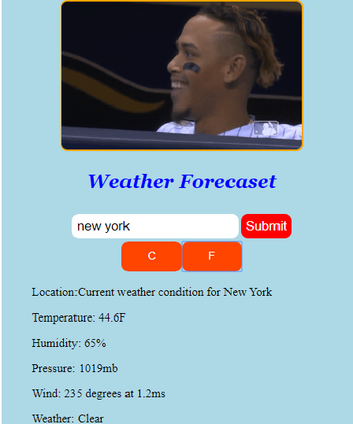

# Weather-App

JavaScript App

## About Project

>This project is a simple page for a displaying weather of the input city, by fetching data from weather api.
 javascript, webpack and api.

## Link to Project

[OdinProject](https://www.theodinproject.com/courses/javascript/lessons/weather-app)

## Built With

-   HTML5,
-   CSS,
-   Javascript
-   Webpack
-   API

## Live Demo

[Live Demo Link](https://raw.githack.com/dev1980/Weather-App/development/dist/index.html)

## Authors

👤 **Brham Dev Mahato**

-   Github: [@dev1980](https://github.com/dev1980)
-   Twitter: [@MahatoBrham](https://twitter.com/MahatoBrham)
-   Linkedin: [linkedin](https://www.linkedin.com/in/dev1980/)
## 🤝 Contributing

Contributions, issues and feature requests are welcome!

Feel free to check the [issues page]().

## Show your support

Give a ⭐️ if you like this project!

## 📝 License

This project is [MiT](https://opensource.org/licenses/MIT) licensed.

